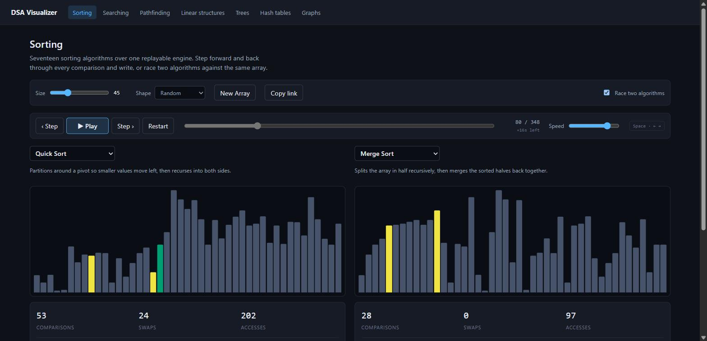
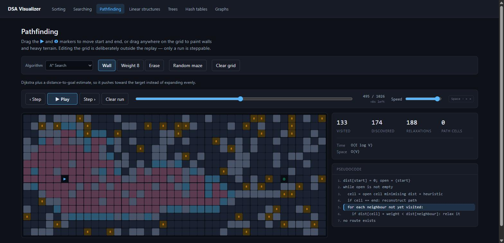
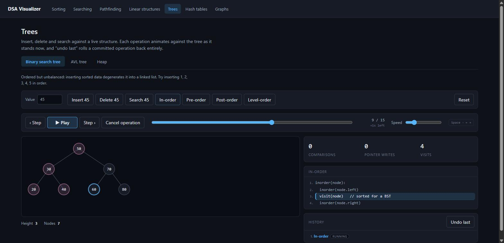

# DSA Visualizer

An interactive visualizer for data structures and algorithms, built with React, TypeScript and Vite.

Every visualization runs on the same replay engine: an algorithm emits discrete, **exactly reversible** steps, and a player walks a cursor through them. That single design decision is what makes it possible to pause anywhere, step *backwards* through an individual comparison, scrub to any point in a run, or change speed mid-animation without restarting — none of which is possible when animation delays are baked into the algorithm itself.

**Race mode** — two algorithms, one array, one clock. Merge has done 28 comparisons where quicksort has done 53:



**Pathfinding** — A\* fanning around walls and heavy terrain, with the pseudocode line it is executing:



**Interactive structures** — operations run against a live tree and land in an undoable history:



## What's in it

| Domain | Contents |
| --- | --- |
| **Sorting** | 17 algorithms, playback controls, live stats, pseudocode panel, side-by-side race mode |
| **Searching** | Linear, binary, jump, interpolation, exponential |
| **Pathfinding** | BFS, DFS, Dijkstra, A*, Bellman-Ford on a grid you draw walls and weights on |
| **Linear structures** | Array, stack, queue, linked list |
| **Trees** | BST, AVL with step-through rotations, min/max heaps, four traversals |
| **Hash tables** | Chaining vs linear probing, collisions, tombstones |
| **Graphs** | Interactive graph building, BFS/DFS traversal, Dijkstra and A* shortest paths |

### Algorithms

**Sorting (17)** — grouped by the machinery they share:

- *Bubble family*: bubble, cocktail shaker, comb, gnome
- *Insertion family*: insertion, shell
- *Selection family*: selection, cycle
- *Divide & conquer*: merge, quick (Lomuto), heap
- *Hybrids*: Timsort and Introsort, composed from the generators above rather than reimplemented
- *Non-comparison*: counting, radix (LSD), bucket
- *For fun*: bogo (size-capped, for obvious reasons)

**Searching (5)**: linear, binary, jump, interpolation, exponential.

**Pathfinding (5)**: BFS, DFS, Dijkstra, A*, Bellman-Ford.

**Graphs (4)**: BFS, DFS, Dijkstra, A* — plus node/edge editing as first-class undoable operations.

## Features

- **Real playback** — play, pause, step forward, step back, scrub to any step, change speed live mid-run.
- **Live stats** — comparisons, swaps, accesses, probes, collisions and more, counted per step and unwound exactly when you step backwards. Non-comparison sorts visibly hold `comparisons` at zero.
- **Pseudocode panel** — highlights the line the current step is executing.
- **Race mode** — run two sorting algorithms against the identical starting array under one shared clock, each with its own stats.
- **Interactive structures** — trees, graphs, hash tables and linear structures accumulate operations against a persistent structure, with a history panel and undo.
- **Input shapes** — random, nearly sorted, reversed, or few-unique arrays, so you can watch insertion sort go near-linear or quicksort degrade.
- **Keyboard control** — Space to play or pause, ← and → to step. Shortcuts yield whichever key the focused control already owns, so arrows still adjust a focused slider.
- **Shareable links** — the sorting and searching pages keep their setup in the URL, so a link reproduces the exact run. Inputs travel as a seed rather than as an array.
- **Colour-blind safe** — visualization states use the Okabe-Ito palette and are separated by lightness as well as hue, so they survive deuteranopia, protanopia and greyscale.

## Architecture

```
src/
  engine/                     Generic replay engine — knows nothing about any domain
    types.ts                    StepEngine<TState, TStep>, AlgorithmDefinition, Frame
    player.ts                   buildSteps, initFrame, stepForward, stepBack, seek
    useStepPlayer.ts            Batch mode: cursor + timer, externally controlled playback
    useInteractiveStructure.ts  Operation mode: persistent structure + operation history
  domains/
    sorting/ searching/ pathfinding/ linear/ trees/ hashtables/ graphs/
      types.ts        the domain's State and Step union
      engine.ts       its StepEngine (applyStep / invertStep / statsDelta)
      algorithms.ts   or operations.ts — pure generators
      components/     its renderer and page
  shared/components/  BarChart, PlaybackControls, StatsPanel, PseudocodePanel,
                      OperationHistoryPanel
  app/                Router, layout, landing page
```

A domain supplies three things and gets the whole player for free:

1. a `State` type,
2. a `Step` discriminated union, and
3. a `StepEngine` — a pure `applyStep` / `invertStep` pair plus a stats-delta table.

**The load-bearing invariant** is that every step carries enough prior data (`prevValue`, `prevChildId`, `prevDist`, …) that `invertStep` never needs to recompute or search backwards. `invertStep(applyStep(s, step), step)` must deep-equal `s` — asserted for every step of every algorithm in the test suite, and it caught two real bugs during the build.

Two consequences of that invariant worth knowing, because they shaped the design:

- **Ordered lists must be append-only.** Graph traversal keeps visited and frontier as separate append-only lists rather than moving ids between them, because removing an id from the middle of a list can't be undone without recording its position.
- **Repeated work needs a cursor, not a set.** Bellman-Ford re-sweeps cells, so it emits a `scan` step that moves a single cursor instead of the cumulative `visit` step the other pathfinders use.

### Batch vs operation mode

Sorting, searching and pathfinding are **batch**: configure the input, hit play, and one full run's steps are generated up front and replayed.

Trees, graphs, hash tables and linear structures are **operation mode**: a persistent structure accumulates user-triggered operations. Three things that are easy to conflate stay distinct there — stepping back *inside* the running operation, cancelling an uncommitted operation, and undoing a *committed* one. Both modes drive the same cursor primitives, and `PlaybackControls` takes identical props either way.

## Running it

```bash
npm install
npm run dev       # dev server at localhost:5173
npm run build     # typecheck + production build
npm run preview   # serve the production build
npm run test      # vitest
npm run lint      # eslint
```

## Deploying

Hosted as a static build on Firebase Hosting. `firebase.json` is committed; the
one-time setup needs a Google account:

```bash
npx firebase-tools login          # interactive, opens a browser
npx firebase-tools use --add      # pick or create a project, alias it "default"
npm run deploy                    # builds, then deploys dist/
```

`npm run deploy:preview` publishes to a temporary preview channel instead, which
is useful for checking a change before it goes live.

**Why the rewrite rule matters.** The app uses client-side routing, so a shared
link such as `/sorting?algo=quick&seed=2024` is a request for a path that does
not exist on disk. The `"**" → /index.html` rewrite in `firebase.json` is what
makes those links resolve; without it every deep link 404s and the shareable-URL
feature is dead on arrival. Any other static host needs the same fallback —
Vercel and Netlify infer it, GitHub Pages needs a `404.html` copy of
`index.html`.

Asset filenames are content-hashed by Vite, so they are served `immutable` for a
year while `index.html` is never cached — otherwise a returning visitor keeps
loading an old page that points at asset hashes the deploy no longer has.

## Tests

437 tests covering:

- the pages themselves — URL round-tripping, the bogo size cap, playback
  stopping on its own, race mode wiring, and the keyboard focus rules. Every
  bug that actually reached the browser during this build lived in this layer,
  not in the algorithms;
- the `useStepPlayer` hook itself — that mounting, StrictMode double-rendering
  and swapping algorithms mid-run do not trigger a render loop, since the reset
  is done by adjusting state during render rather than in an effect;
- every sorting and searching algorithm across random, sorted, reversed, duplicate, all-same, empty and single-element inputs;
- exact step inversion for every step of every algorithm in every domain;
- full step-back to the exact starting state with all counters returning to zero;
- pathfinding routes checked against a brute-force Dijkstra reference, including unreachable cases;
- BST ordering and AVL balance invariants across 80-operation randomized insert/delete sequences;
- heap ordering, and extraction returning values in sorted order;
- hash tables under both strategies across 120-operation randomized sequences, including the tombstone case a naive delete breaks;
- graph shortest paths checked against Floyd-Warshall for every node pair;
- linked lists mirrored against a plain array through 60 random operations;
- hand-checked counters (bubble sort on `[3,1,2]` is exactly 3 comparisons and 2 swaps);
- every emitted pseudocode line index being in range.
